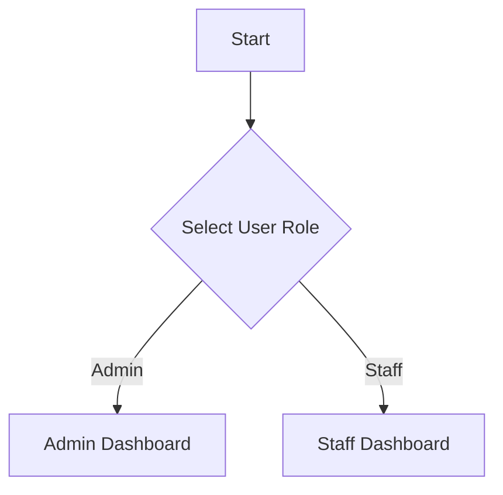

# 🧺 Smart Laundry Management System

## 📝 System Overview

The Smart Laundry Management System is a comprehensive application designed to streamline laundry service operations, providing functionalities for both administrators and staff.

## 🔐 User Roles

The system supports two primary roles:

1. **Admin**
2. **Staff**

## 🖥️ System Workflow

### Initial Login

### Admin Dashboard

#### Main Menu Options

1. **Manajemen Layanan** (Service Management)
2. **Manajemen Pesanan** (Order Management)
3. **Manajemen Proses** (Process Management)

#### 1. Service Management

##### Actions

- Tambah Layanan (Add Service)
- Lihat Layanan (View Services)
- Ubah Layanan (Modify Service)

###### Add Service Details

- **Kode Layanan**: Unique service code (e.g., L001)
- **Nama Layanan**: Service name
- **Harga per KG**: Price per kilogram
- **Estimasi Waktu**: Estimated processing time
- **Status Layanan**: Service status

#### 2. Order Management

##### Actions

- Tambah Pesanan (Add Order)
- Lihat Pesanan (View Orders)

###### Add Order Details

- **Nomor Pesanan**: Unique order number (e.g., NP001)
- **Tanggal Masuk**: Entry date
- **Jenis Layanan**: Service type
- **Berat Cucian**: Laundry weight
- **Jenis Pakaian**: Clothing type
- **Deadline**: Completion deadline
- **Status Pesanan**: Order status

#### 3. Process Management

##### Process Order Status

1. Diterima (Received)
2. Sedang Dicuci (Washing)
3. Sedang Disetrika (Ironing)
4. Selesai (Completed)
5. Diambil (Picked Up)

### Staff Dashboard

#### Main Menu Options

1. **Manajemen Pekerjaan** (Job Management)
2. **Pencatatan Pesanan** (Order Recording)

#### 1. Job Management

##### Actions

- Lihat Antrian Hari Ini (View Today's Queue)
- Lihat Detail Pesanan (View Order Details)
- Lihat Estimasi Penyelesaian (View Completion Estimates)

#### 2. Order Recording

##### Actions

- Tambah Pesanan (Add Order)
- Cetak Nota (Print Receipt)
- Cari Pesanan (Search Order)

## 🎯 System Features

### Key Functionalities

- Dynamic order generation
- Service and order management
- Status tracking
- Flexible user roles
- Detailed reporting

## 💡 Best Practices

1. Generate unique codes for services and orders
2. Maintain clear status tracking
3. Implement detailed order information
4. Support flexible service types

## 🚀 Future Improvements

- Implement advanced reporting
- Add customer management
- Integrate payment system
- Create mobile application

## 📄 Closing

The system concludes with a thank you message: "Terima kasih telah menggunakan Smart Laundry" (Thank you for using Smart Laundry)

---

**Note**: This documentation provides a high-level overview of the Laundry Management System workflow and key components.
